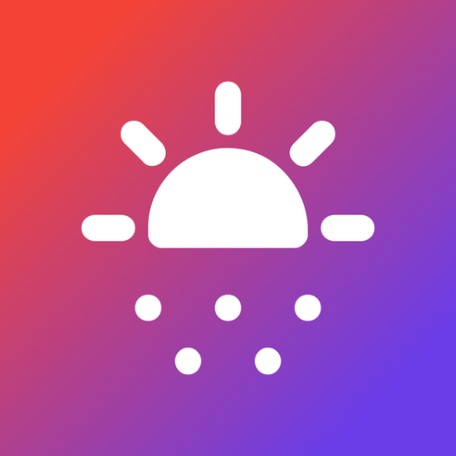
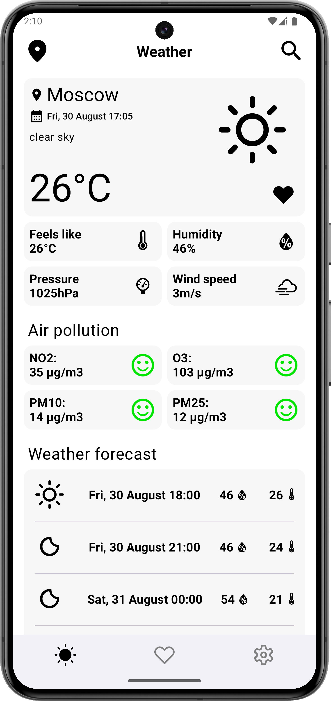
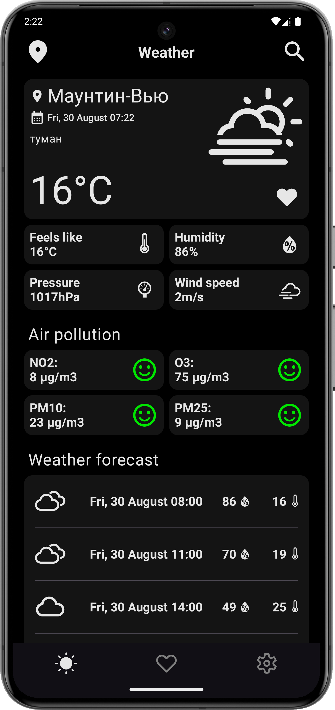
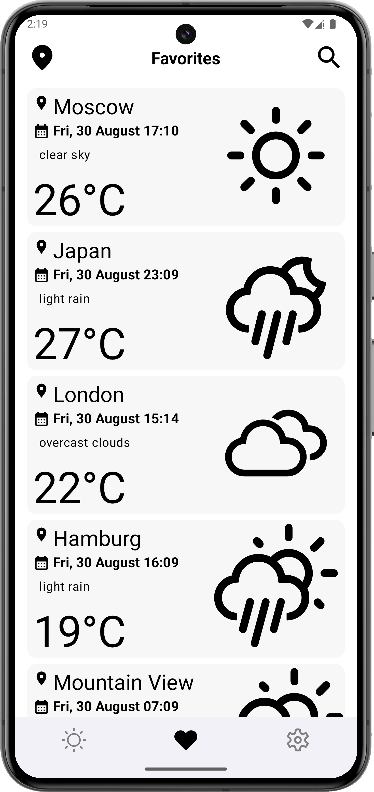
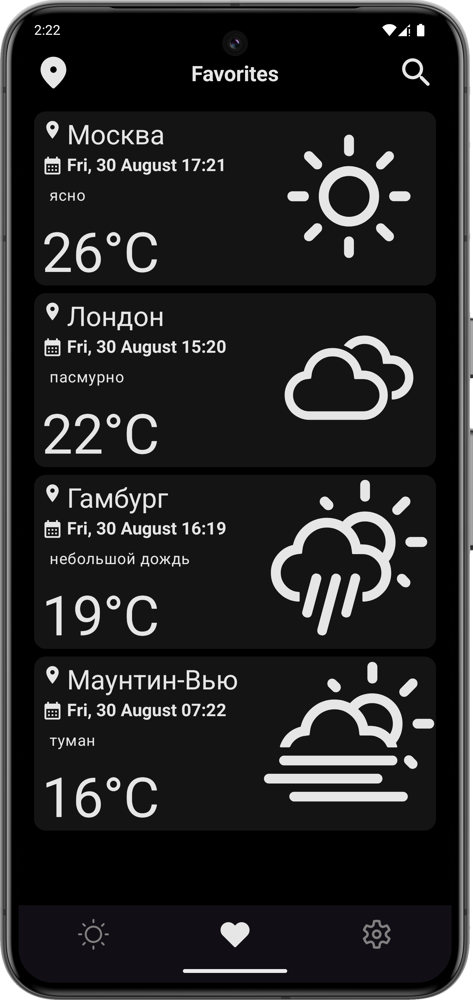
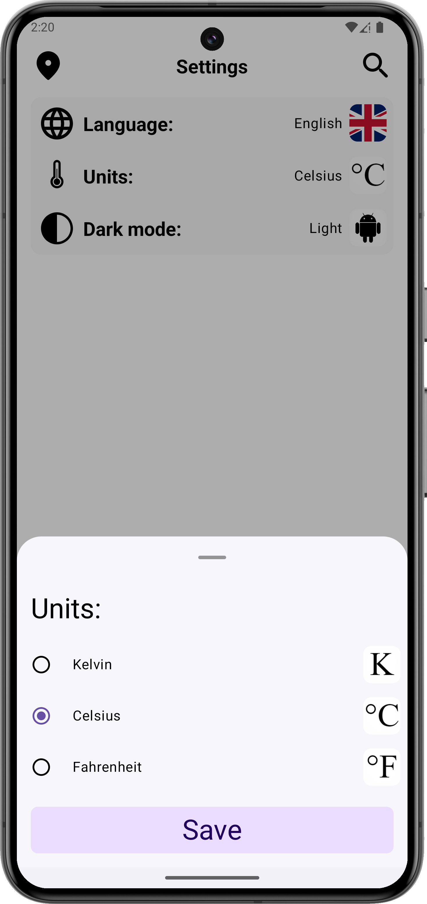
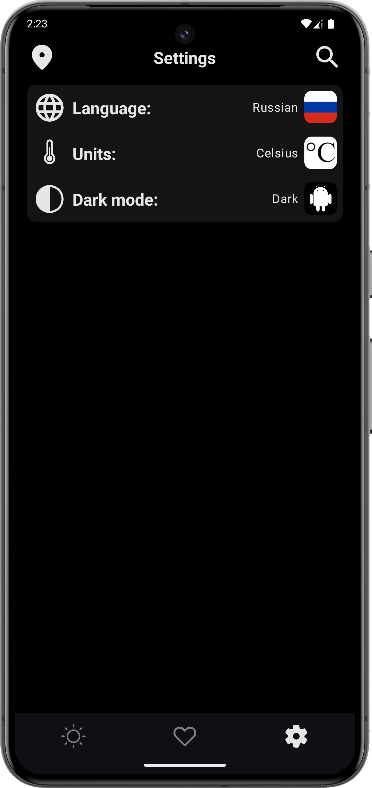
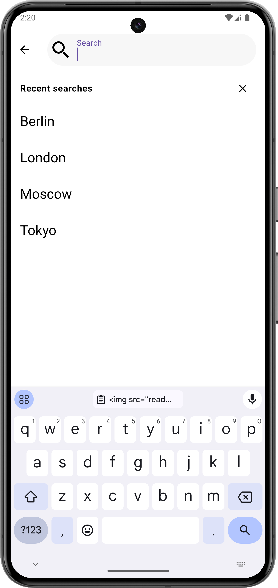
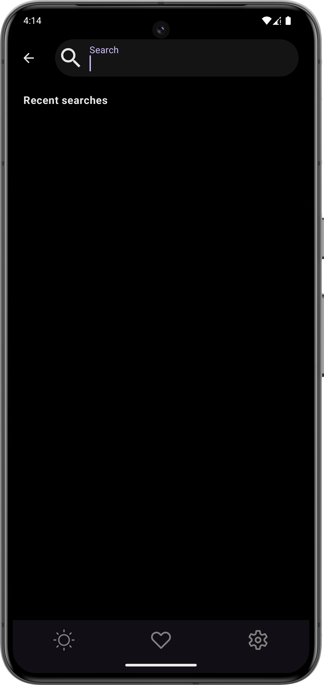
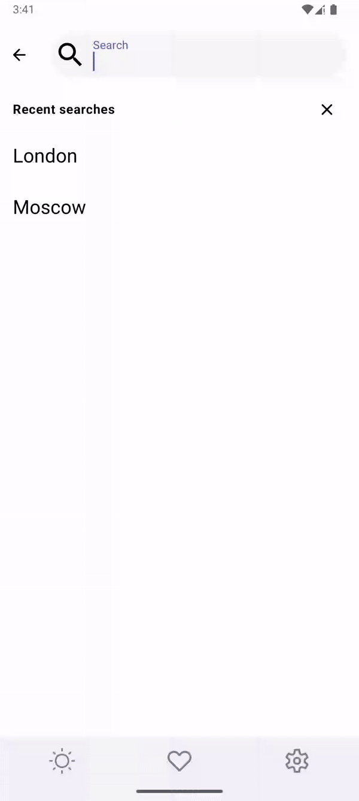

# Weather Forecast Compose App



Weather Forecast Compose is a simple weather and air pollution forecast application that uses some
APIs to get 3 day / 3 hour forecast data from [OpenWeatherMap](https://openweathermap.org/api).
More info on how to make an api call [here](https://openweathermap.org/api/one-call-3#multi).
It is possible to get the weather by searching or by current location, as well as change the language and units of temperature measurement.

### Pre-requisite 📝

You need to create `apikeys.properties` and add your Open Weather [`Api Key`](https://home.openweathermap.org/api_keys).

```properties
API_KEY = "YOUR KEY"
```

*Environment*

- Built on Android Studio Koala+

### Architecture 📐

* MVI
* [Kotlin](https://kotlinlang.org/)
* [Compose](https://developer.android.com/compose)
* [Coroutines](https://github.com/Kotlin/kotlinx.coroutines)
* [Flow](https://kotlinlang.org/docs/flow.html)

### Preview 📷

|                                 Light mode                                  |                                Dark mode                                 |
|:---------------------------------------------------------------------------:|:------------------------------------------------------------------------:|
|      |      |
|  |  |
|    |    |
|        |        |

### Features 📱

<p align="center">



</p>

### Libraries and tools 🔨

* ViewModel
* Datastore
* RoomDB
* Hilt
* Retrofit
* OkHttp
* Kotlinx Serialization
* KSP